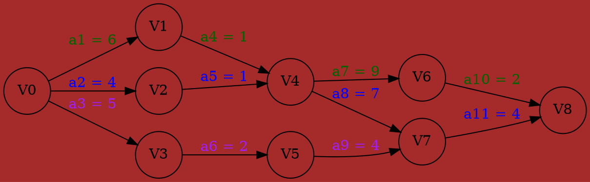
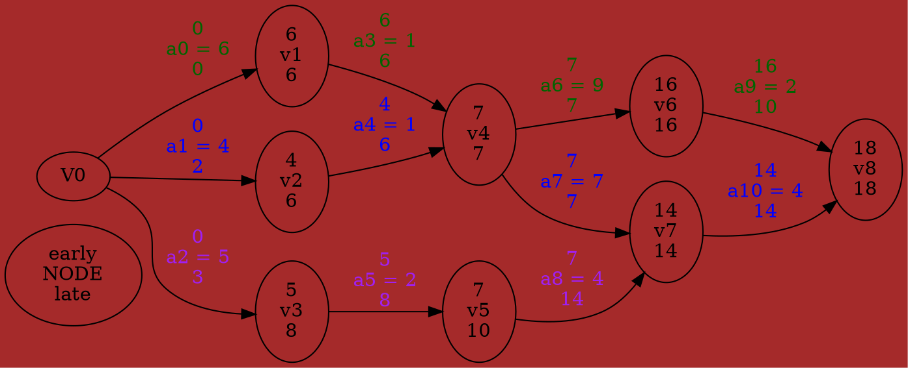
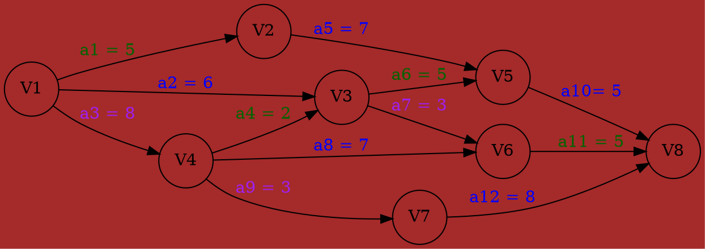
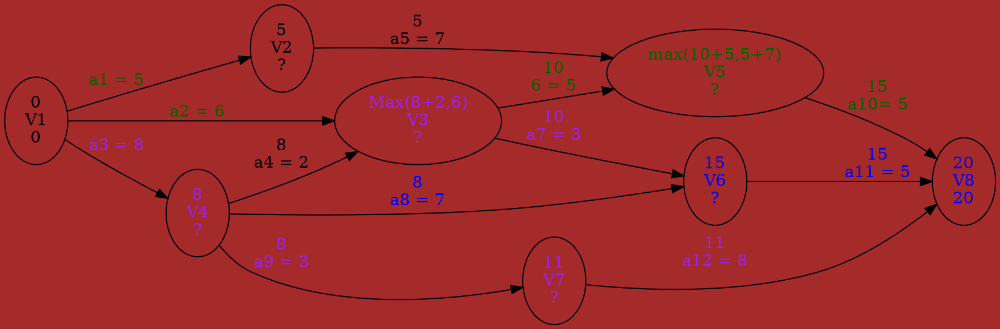
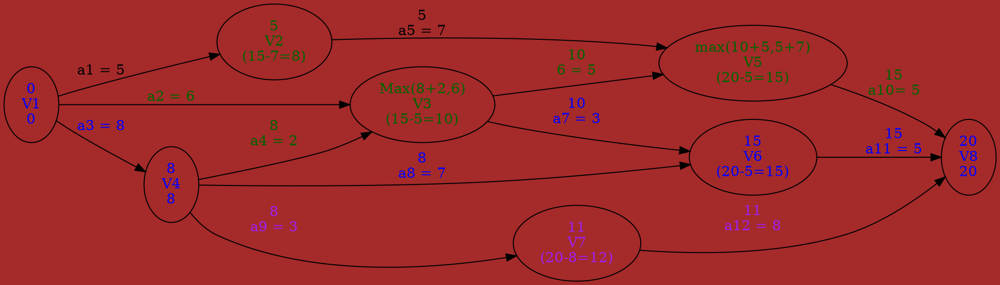

###### tags: `Data Structure`
# Activity On Edge Network (AOE)

[TOC]

## Application of AOE network

- Directed edge : task or activities to be performed
- Vertex : event
   > find the max weight of in-degree to make the event occur
- Number : time required to perform the activity





  | event | Interpretation |
  | ----  |    ------      |
  | V0    | **start** of Task         
  | V1    | completion of activity a1
  | V4    | completion of activity a4 and a5
  | V7    | completion of activity a8 and a9
  | V8    | completion of Task


- Evaluate performance (**Edge**)
    - minimum amount of time
    - activity whose duration time should be shortened
    ```
    Earliest(6) = Earliest(7) = 7
    ```
- Earlist Time `(MAX)` that Vi can occur
    - the Len of the longest path from $V_0$ to $V_i$
- Latest time of activity (**Edge**)
    ```
    late(5) = 8, late(7) = 7
    ```
- Critical Activity
    - late(i) = early(i)
- Critical Path
    - minimum time required to complete the project(each node's late = early)
    
- late(i) - early(i)
    - Measure of how `Critical` an Activity is
    
    ```
    late(5) - earl(5) = 8 - 3 = 5
    ```
---


- $Earlist[vertex_x]$ : $$ earlist[0] = 0 \\ earlist[j] = \max \{earlist[i] + duration of <i,j>\}$$
- $Latest[vertext_x] \ und \ Late[a_x]$ : $$early(i)=earliest(k) \\ late(i) = latest(l) - duration \ of \ A_i \\ latest[k] = \min \{latest(l) - late(i), latest[j] - late[j] $$

## Beispiel


#### Earliest and Early (Start to End)


#### Late and Latest (End to Start)




- Q & A
    -
    1. 完成此計畫最快需要？天：
        A. 求出Critical Path的長度 -> Start to End's Longest Length => 20天
        Cirtical Path
        ```graphviz
        digraph example{
            bgcolor = brown;
            rankdir = LR;
             v1[label="0\nv1\n0"];
             v4[label="8\nv4\n8"];
             v3[label="10\nv3\n10"];
             v6[label="14\nv6\n15"];
             v5[label="15\nv5\n15"];
             v8[label="20\nv8\n20"];
             v1 -> v4[label="a3"] ;
             v4 -> v3[label="a4"] ;
             v3 -> v5[label="a6"] ;
             v5 -> v8[label="a10"];
             v1 -> v4[label="a3"] ;
             v4 -> v6[label="a8"] ;
             v6 -> v8[label="a11"];
            }
        ```
    2.  Critical Tasks ?
        A. 所有在Critical path上的tasks都不能Delay(latest == earliest)
        ```
        C.path_1 : {a3,a4,a6,a10}
        C.path_2 : {a3,a8,a11}
        C.path_1 OR C.path_2 = {a3,a4,a8,a6,a11,a10}#
        ```
    3. 加速哪些event可有效縮短計畫天數
        ```
        取interaction : C.path_1 and C.path_2 => {a3}
        ```
    4. 哪些工作可以delay?  哪些工作不影響進度?
        ```graphviz
            digraph example{
                bgcolor=brown;
                rankdir = LR;
                V1[label="0\nV1\n0",fontcolor=blue;]
                V2[label="5\nV2\n(15-7=8)",fontcolor=darkgreen]
                V3[label="Max(8+2,6)\nV3\n(15-5=10)",fontcolor=darkgreen]
                V5[label="max(10+5,5+7)\nV5\n(20-5=15)",fontcolor=darkgreen]
                V4[label="8\nV4\n8",fontcolor=blue]
                V6[label="15\nV6\n(20-5=15)",fontcolor=blue]
                V7[label="11\nV7\n(20-8=12)",fontcolor=purple]
                V8[label="20\nV8\n20",fontcolor=blue]
                V1 -> V2[label="0\na1 = 5\n3", fontcolor=darkyellow];
                V1 -> V3[label="0\na2 = 6\n4", fontcolor=darkgreen];
                V1 -> V4[label="0\na3 = 8\n0", fontcolor=blue];
                V4 -> V3[label="8\na4 = 2\n8",fontcolor=darkgreen];
                V2 -> V5[label="5\na5 = 7\n8"]
                V3 -> V5[label="10\na6 = 5\n10", fontcolor=darkgreen]
                V5 -> V8[label="15\na10= 5\n15", fontcolor=darkgreen]
                V3 -> V6[label="10\na7 = 3\n12", fontcolor=blue]
                V4 -> V6[label="8\na8 = 7\n8", fontcolor=blue]
                V6 -> V8[label="15\na11= 5\n15",fontcolor=blue]
                V4 -> V7[label="8\na9 = 3\n9", fontcolor=purple]
                V7 -> V8[label="11\na12 = 8\n12",fontcolor=purple];
                
            }
        ```
        - A1. 
            不在Critical Path上的的工作(works)都可以delay
        - A2. 
        (Event's Elriest , Latest)
          | event(V<sub>i</sub>) | 1| 2 | 3 | 4 | 5 | 6 | 7 | 8 |
          |  ---------      | -| - | - | - | - | - | - | - |
          | Earliest **max**| 0| 5 | 10| 8 | 15| 15| 11| 20|
          | Latest **min**  | 0| 8 | 10| 8 | 15| 15| 12| 20|
           (Edges)
          | Works(a<sub>i</sub>)    | 1| 2 | 3 | 4 | 5 | 6 | 7 | 8 | 9 | 10 | 11 | 12
          |  ---------      | -| - | - | - | - | - | - | - | - | -| -| -|
          | Earliest **max**| 0| 0 | 0| 8 | 5| 10| 10| 8| 8| 15| 15| 11
          | Latest **min**  | 3| 4 | 0| 8 | 8| 10| 12| 8| 9| 15| 15| 12
        
         
## Topological Sort 
- A Directed `Acyclic` Graph (DAG)
    - has one or more number of toplogical sort
    - is widely used `scheduling applications`.
        - the jobs that have to be complete
- A `directed graph` in which the vertices represent tasks or ctivities and the edges represent `precedence relations` between tasks.
- If `AOV Network has a Cycle` => Topological Order doesn't exist Otherwise Toplogical &ge; 1 set 
- Definition
    --
    1. Topological order:
linear ordering of vertice    s
of a graph
&forall; i, j if i is a predecessor of
j, then i precedes j in the linear ordering
    2. Acylic graph : a directed graph with no directed Cycle
 

- Algo
    ---
    1. **Create** Output ={}
    2. **Find** the Node x which indegree = 0 (e.g $V_0$)
    3. **Delete** All the Out-Degree of node x 
    4. repeat **Vorgang 1 und 2** till all the vertex in Output ={$V_0, ... , V_n$} or Rest Nodes have only with Out-Degree
    


- EXAMPLE 
  ---
    
  
    
  
    


- DFS with Directed
    ---
    ```c=
    int edge_classification(int x, int y) {
        if (parent[y] == x) 
            return(TREE);
        if (discovered[y] && !processed[y]) 
            return(BACK);
        if (processed[y] && (entry_time[y]>entry_time[x]))
            return(FORWARD);
        if (processed[y] && (entry_time[y]<entry_time[x]))
            return(CROSS);
        printf("Warning: self loop (%d,%d)\n", x, y);
        return -1;
    ```

### Algo Oxford version (Using Queue)


```c=
#include <stdio.h>
#include <conio.h>
#define MAX 10
//global 
int n,adj[MAX][MAX]                ;
int front = –1,rear = –1,queue[MAX];
//void display();
void insert_queue(int)
{
    if(rear == MAX - 1) printf("Overflow");
    else
    {
        if(front == -1) front = 0;
        queue[++rear] = node     ;
    }
}
int delete_queue(void);
{
    if(front == -1 || front > rear){
        printf("UnderFlow");
        return ;
    }
    else{
        int del_node = queue[front++];
        return del_node              ;
    }
}
int find_indegree(int node) 
{
//using matrix is the most fast way
    for(int i = 0; i <= n ; i++){
        if(adj[i][node] == 1)
            in_deg++;
    }
    return in_deg   ;
}

void main()
{
    int node,j = 0,del_node, I;
    int topsort[MAX],indeg[MAX];
    
    for(node = 1; node <= n; node++){
    //Find the in–degree of each node
        indeg[node] = find_indegree(node);
        if(indeg[node] == 0)  insert_queue(node);
    }
    
    while(front <= rear ){
        del_node = delete_queue();  
        topsort[j++] = del_node;
    }
    
    for(node = 1 ; node <=n ; node++){
        if(adj[del_node][node] == 1){
            adj[del_node][node] = 0;
            --indeg[node]          ;
            if(indeg[node] == 0) insert_queue(node);
        }
    }
    // the topological
    for(node = 0 ; i < j ; node++)
        printf("%d", topsort[node]) ;
```

### RedBook
- using Stack
```c=
void process_vertex_late(int v) {
    push(&sorted, v);
}
void process_edge(int x, int y) {
    /* edge class */
    int class = edge_classification(x, y);
}
if (class == BACK) {
printf("Warning: directed cycle found, not a DAG\n");
}
void topsort(graph *g) {
int i;
 /* counter */
init_stack(&sorted);
}
for (i = 1; i <= g->nvertices; i++) {
if (!discovered[i]) {
dfs(g, i);
}
}
print_stack(&sorted);
 /* report topological order */
```