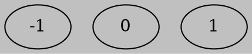
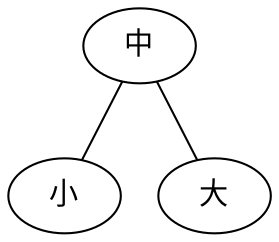
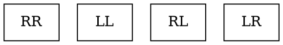

###### tags: `Data Structure`
# Advanced Tree
[TOC]
## Extend Binary Tree
1. es gibt n nodes (via LinkList) => es gibt n+1 個NULL 
2. External = Internal + 1 
3. Binary Search Tree觀點 : 
搜尋到外部節點 => Fail (Misslingen)


### Internal and Extended Path Len


- Internal Path Len 
(n : total Nodes of BST) 
${I = \sum_{i=1}^{n} \ Root \ to \ Internal \ node^{Xth}}$
$Root = 0$

- External Path Len
${E = \sum_{i=1}^{n+1} \ Root \ to \ External \ Node^{Xth}}$

### Skewed Extended B.T
- E und I 呈正比 
- Wenn E und I Grosser sind meint Efficiency Suck ist
    -  Weight External Path Length 則不一定 


## Weight External Path Length 


## AVL

- Goal : Es wird `Skewed's Fall` passieren wenn `Dynamic Data von BST algo` betribt sich 
    - Was bringt Skewed's Fall ?
        A. es wird Zeitkomplexität schlechter,(z.B Insertion,Search,deletion Q(n) haben)
    - Wir hoffen dass die Höhe **可以維持最小化(平衡化)使高度為O(logn)**
如此一來Betreibe von search,deletion und Insertion有O(logn)的Zeitkomplexitaet 

- Def : A Givien `height Balanced Binary Search Tree` and if it's not null then satafies
- **$|br| = |H_L - H_R| \le 1$**
H<sub>L</sub> :HeightofLeftTree
H<sub>R</sub>:HeightofRightTree
br : Blance Factor 


    
### Balance Factor
In AVL Tree Nodes's Blace Factor nur `Drei Möglichkeiten` hat
$BF(x) = LenleftChild(x) - LenrightChild(x)$


    
### Types of Violations
- Ursache：
當Inserted Node x後使離它`nearst node turn Unbalance`

    
### Methods to Solve the Unbalance
- BST Concept 




   
 


## m-way Search Tree

- Process for `External Search`
- `Tree Degree = m ,  m > 2`
- m 可當作 memory Size
:::success
Internal Search
    - 資料量少
    - 可一次全部放置於Memory做Search
External Search
    - 資料量大
    - 無法一次儲存在Memory需要額外Medium補助做search 
:::

### Better Efficiency for External Search

- 作業系統,計算機結構Concept
    減少IO動作 => 降低Search Tree高度 => 需要增大Tree Degree 


## B-Tree

- Regel
  ---
    - Root at Least `2` child
    - $\frac{m}{2} {\le} \ Node \ degree \  {\le} m$
    - $\frac{m}{2} - 1 {\le} \ keys \ {\le} m - 1$
        - keys : Number of Value in A node
    - All the `Failure Node (leaf)` Should be at the same level (Height)

### Insertion Algo

$Overflow : key \ge m$

```c
1. do BST search to find the right position(AT LEAF ONLY)
2. insert
3. if(overflow)
4.      do Split  
        if(overflow) // check the parent if overflow
            goto 3
   else
       exit          // there are no overflow
```
- Split()
    ---
    


### Delete Algo
- Two Cases 
   - Case 1 : X is Leaf 
   - Case 2 : X is Non-Leaf
```c
1. do BST search to Find Out X
2. If(X is at Leaf)
    delete(node(x)th)
    if(underflow)
        1. do Rotate or Combine
    else exit 
3. if(x is Nonleaf)    
    do x = x.successor || x = x.predecessor
    go to 2
```

- Rotation
    ---
    

- Combine
    ---
    

### Example Deletion

- At Leaf
    
 
    

- Non Leaf Node


